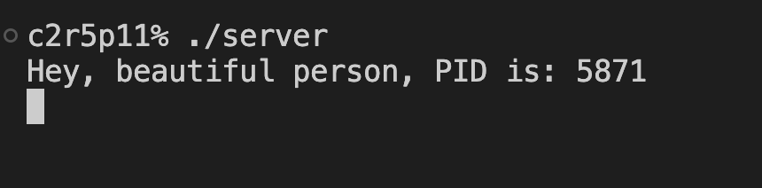
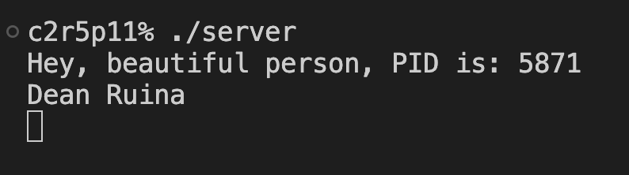
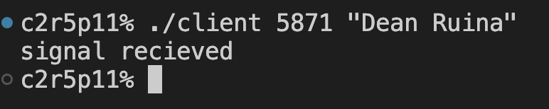
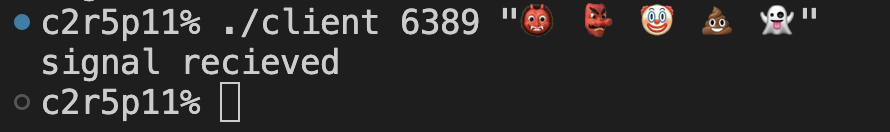
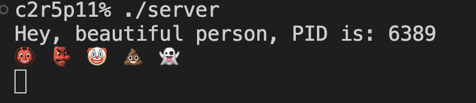

# minitalk

- This project creates two executables: server & client.

- The client will send information (a string) to the server using UNIX signals and then will dispaly a message after the information has reached the server.

- The server must correctly receive and interpret this information, display it and then send a signal back that acknowledges the recieved information.

- The Makefile compiles both the server and the client as executables.
```bash
 make
```

### Behaviour:

1) By running the server executable we start up the server and it displays a message and its process id:


2) By running the client executable with the server's process id as a first argument we can add any string we want as a second argument:


3) The server receives signals which are translated to bits which are then translated to characters. The server prints the result as a string:


4) Before the printing of the string the server sends a signal back to the client which approves the string was recieved. The client then prints a message:


#### Additional behaviour:
1) The client can also send Unicode format characters


2) The server interprets and displays them correctly 


3) The server can recieve signals from multiple clients without needing to restart


### Evaluated by 42 


## Author

- [@DeRuina](https://github.com/DeRuina)
